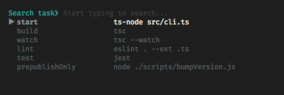
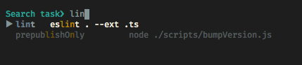

# NPMR
[](https://github.com/maoryosef/npmr/actions/workflows/pr-test.yml)
[](https://www.npmjs.com/package/@maory/npmr)

List search and execute the available scripts in your project

## installation
```bash
npm i -g @maory/npmr
```

## usage
```bash
npmr
```
Run it in the top level of your project



start typing to do a fuzzy find on your scripts



Press `enter` to execute the script